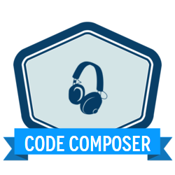

# Musical Code

  <em>NOTE:</em> Due to limitations of GitHub's markdown rendering, it is 
  highly recommended that you view this page 
  <a href="https://coding-competitions.github.io/musical-code/">here</a>.

## Challenge

Write a complete program, in the language of your choice, in **512** bytes or 
less of source code, the output of which can be interpretted as a raw audio 
waveform. The output may either be directed to `stdout` or a file name 
specified by command line parameters. Your program must also terminate by 
itself after approximately 30 seconds worth of raw data has been produced. 
If your program relies on external data, libraries, or command line arguments 
or switches (excluding the filename or wave format parameters) in order to 
produce the appropriate output, these will be counted toward the 512 byte 
limit.

The program must be accompanied by a `README.md` file which contains the 
information required to interpret the waveform, in the following format:

    ---
    layout: { entry }
    title: { title }
    author: { github username }
    lang: { language }
    len: { total length in bytes }
    params:
      r: { sample rate in Hz }
      b: { sample size in bits }
      c: { number of channels: 1 = mono, 2 = stereo }
      e: { encoding: (si)gned-integer, (un)signed-integer, (fl)oating-point }
    commands:
      build: { command needed to build the program (if needed) }
      run: { command needed to run the program }
    ---

    {{ description of the entry in markdown }}

If the output of the program is non-deterministic (e.g. randomly generated), 
be sure to make note of that in the description. Refer to the examples below 
for more information.

### Utilities

For consistency, all entries will be evaluated with the 
[SoX utility](http://sox.sourceforge.net/). This may be installed locally on 
most systems, *or* if you prefer not to install it locally, you can use the 
provided [Docker image](util/sox/README.md).

### Examples

The following example submissions have been provided:



## Submissions

To submit an entry to this competition, start off by forking this repo. Create 
a new subdirectory under `_entries/` to house your entry, and develop your 
code under there. Write a `README.md` file which includes the relevant 
information as described in the [Challenge](#Challenge). Once you're satisfied 
with the results, submit a pull request to have your entry merged in with the 
others.

Contestants may submit multiple entries.

A submission may be rejected if it fails to satisfy any of the requirements 
described above, if the moderators of the competition are unable to compile or 
run the program, or if the entry appears to be copied from other entries 
without any significant modification. 

Entries must be submitted as an issue before Friday, Nov 30, 2018.

## Judging

This is a **subjective** competition, meaning the winner will be decided by 
popular vote. Any eligible voter is welcome vote on any accepted enter, 
*including their own*. 

Voting method is TBD.

Anyone who submitted an entry that was accepted 

The final vote count shall be taken on Friday, Dec 7, 2018. Votes submitted 
after this date shall not be counted.

The entry that receives the most votes shall be declared the winner. In the 
event of a tie, the entry with the fewer source bytes shall be declared the 
winner.

## Awards

The contestant that submitted the winning entry shall be awarded this ✨shiny✨ 
badge!

  

