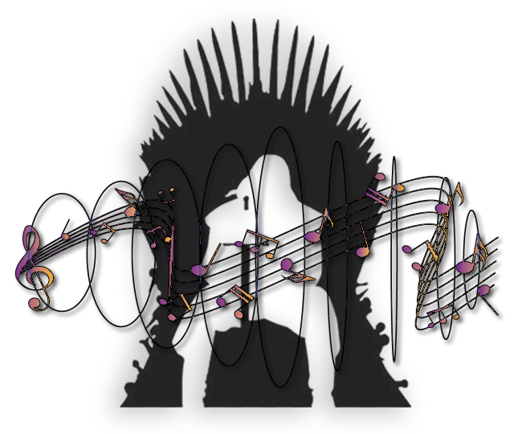
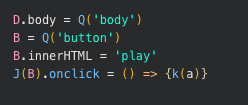
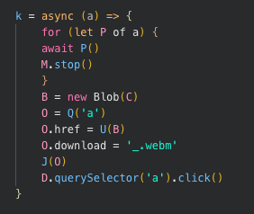
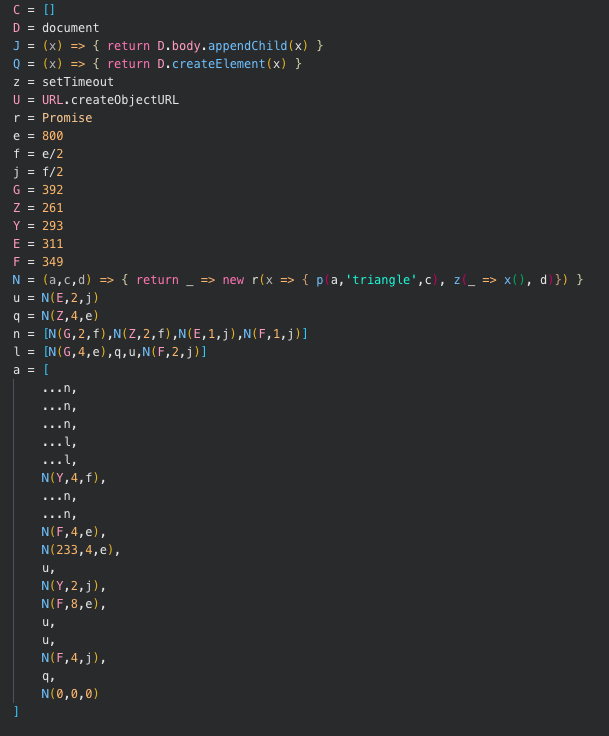
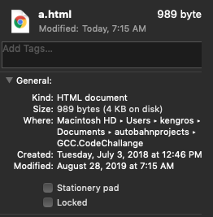

<h1 align="center">
   
  </a>
   
  Song of Thrones
   
</h1>

<h4 align="center">A minimal sound generating coding challange</h4>
<h3 align="center">Challange Accepted</h3>

## Layout

### Application FAQ 
|Author         |Title          |Language       |Platform       |Size           |
| :-----------: | :-----------: | :-----------: | :-----------: | :-----------: |
|Ken Gros       |Song Of Thrones|Javascript/HTML|Google Chrome  |989b           |

### Sample FAQ
|Rate           |Frequency Range|Channels       |Encoding       |File Size      |
| :-----------: | :-----------: | :-----------: | :-----------: | :-----------: |
|48000Hz        |260Hz - 390Hz  |2 Channel      |webm           |187kb          |

## Technique

### Step 1

</a>
 
The `body` tag is created and a `button` is placed inside with a click event attached.
 
### Step 2

</a>
 
When the `button` is clicked an async function calls a secondary function that will return a promise to the primary.

### Step 3

</a>
 
The secondary function accepts 3 variables `frequency`, `wave shape` and `duration` from an array of `notes`.
- First: it creates the `AudioContext`, `Oscillator` and `Gain` which are required to hear sound.
- Second: it connects the `MediaStream` to the `Destination` which are required play the sound over the device's speakers
- Third: it creates a `MediaRecorder` which is required to capture and store each sound so that it can be written to a file and downloaded.
- Fourth: it starts the `MediaRecorder` and the `Oscillator` and after the specified `duration` pushes the chunk of data to an array. 
- Fifth: the secondary function completes and the promise to the primary is fulfilled, the primary function resumes
 
</a>
 
The array of `notes` is built with the above function.

### Step 4

</a>

In the next phase of the primary function the chunks of audio are combined with `Blob` and encoded. Once this step is complete the url of the encoded media is assigned to an `<a>` tag and a click event is fired on it starting the download of the file. 

</a>

<h6 align="center">** All images show non-minified code for readability **</h6>

## Golf Score

  </a>

  ## How To

* Navigate to `a.html`
* Open with Chrome browser
* Press `play` button
* Once the audio has finished playing the app will create an automatic download in `.webm` format
* Navigate to the `Downloads` folder on your local disk
* Locate `_.webm`
* Open `_.webm` with Chrome browser
* Enjoy the audio again
