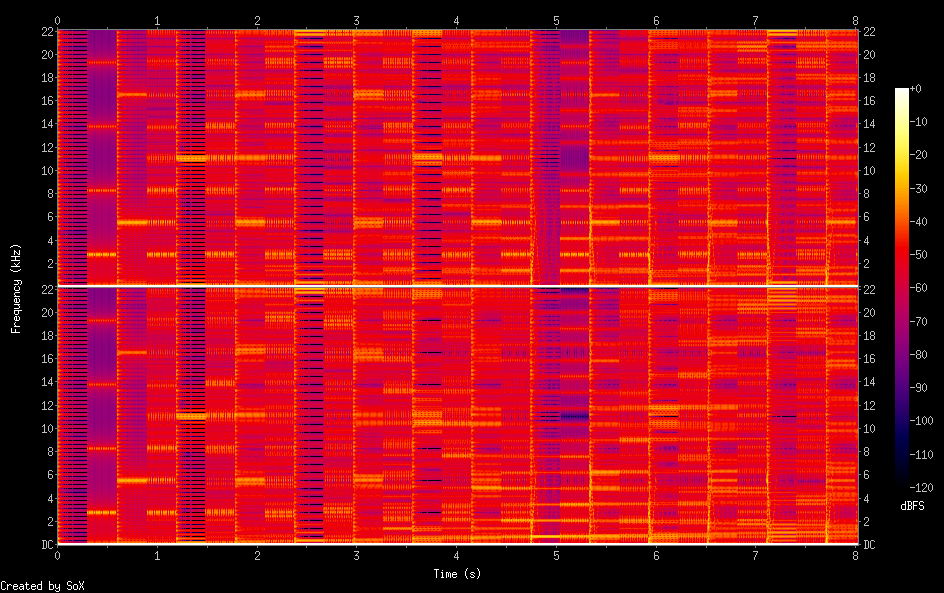

# Crickets from Outer Space (C#, 399 bytes)

> **Listen:**
> <audio controls src="out.ogg"><a href="out.ogg">click here</a></audio>

Some sweet serenade by spectral stenopelmata—an example submission written in C#.

* Sample rate: 44.1 kHz
* Sample size: 16 bits
* Channels: 2 (stereo)
* Encoding: unsigned-integer

To run this sample, first run this command to initialize the `cs.csproj` file:

    dotnet new console

From then on, the sample code can be compiled from the command line with one of the following commands:

    # native version
    dotnet run | sox -t raw -r 44100 -b 16 -c 2 -e un - -t ogg out.ogg

    # docker version
    dotnet run | docker run --rm -i sox -t raw -r 44100 -b 16 -c 2 -e un - -t ogg -> out.ogg

